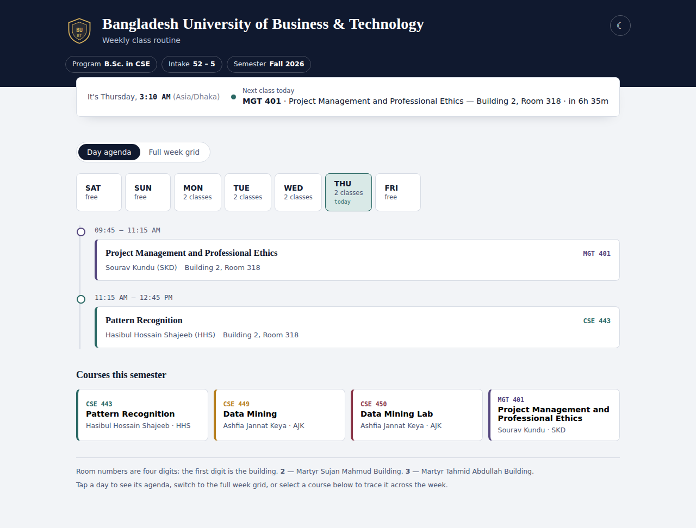
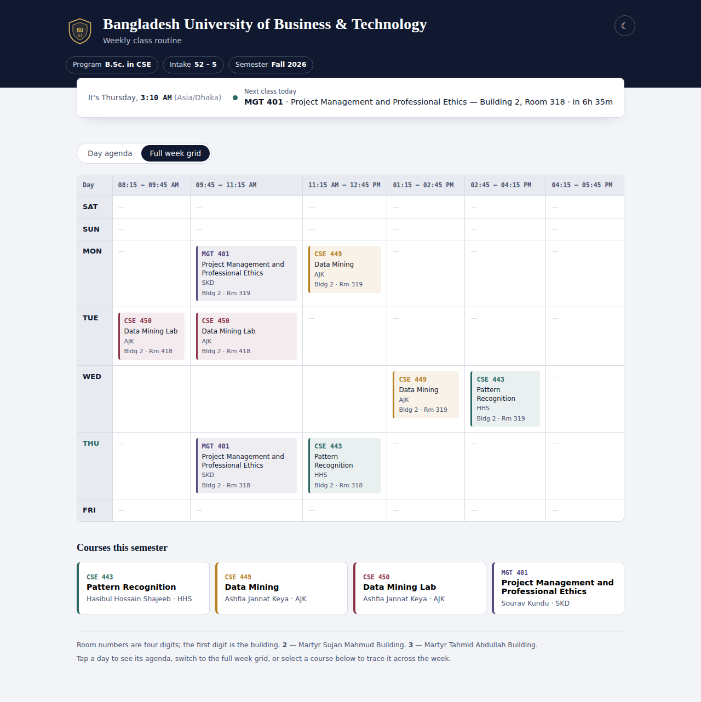
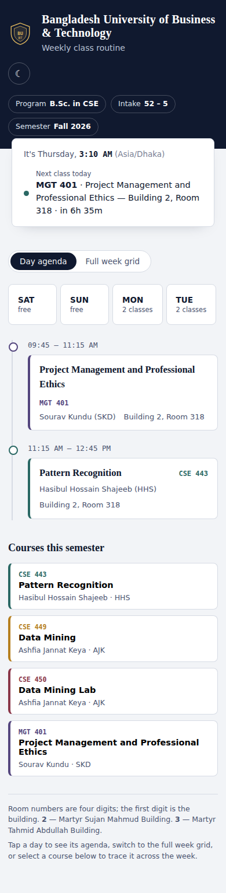
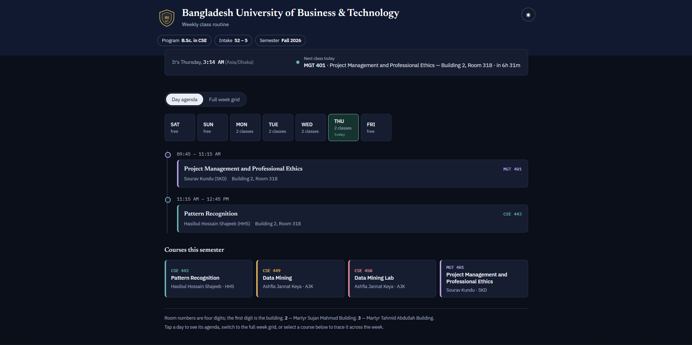

# BUBT CSE 52-5 — Fall 2026 Class Routine

An interactive, single-file class routine for **B.Sc. in CSE, Intake 52‑5, Fall 2026** at Bangladesh University of Business & Technology (BUBT).

## Features
- Live Asia/Dhaka clock with a "happening now" / "next class" status and countdown
- Day agenda view — auto-advances to tomorrow once today's last class ends
- Full week grid view — responsive, reflows into per-day cards on mobile
- Room codes split into Building + Room (e.g. `2319` → Building 2, Room 319)
- Click a course to trace/highlight it across the whole week
- Light / dark mode, remembered between visits

## Screenshots

**Day agenda**

**Full week grid**

**Mobile**

**Dark mode**

## Usage
Just open `routine.html` in any modern browser.

To update for a new semester, edit the `COURSES` and `SCHEDULE` objects near the top of the `<script>` block in `routine.html`.

## Tech
Plain HTML, CSS, and vanilla JS. Fonts: Newsreader, IBM Plex Sans, IBM Plex Mono (Google Fonts).